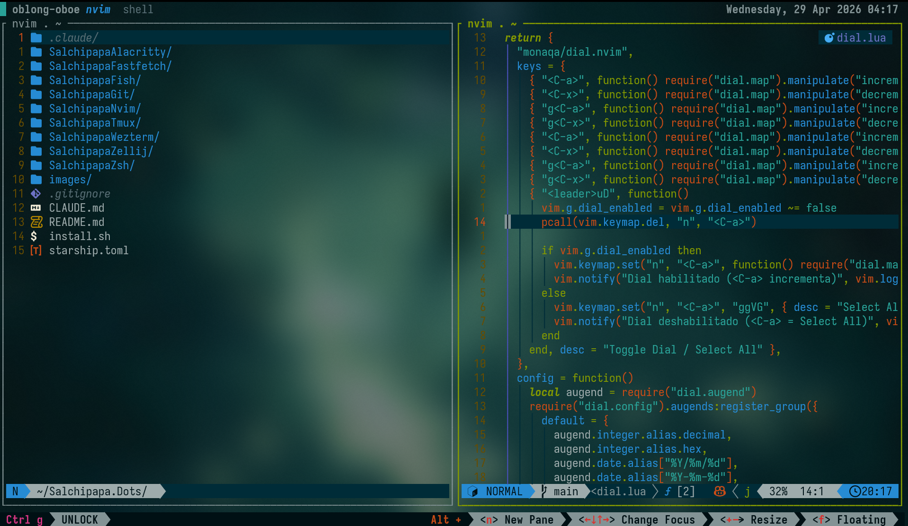
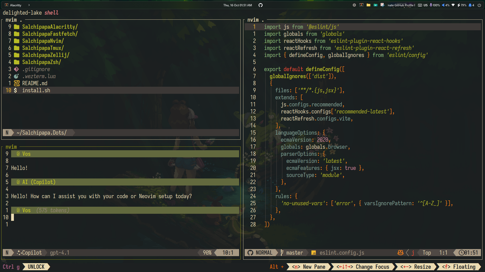
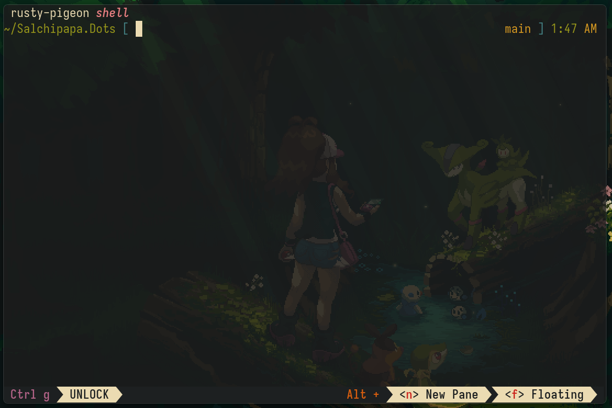

# Salchipapa.Dots

<p align="center">
  
  
  <br>
  
</p>

---

## Description

**Salchipapa.Dots** is an automated development environment setup for Linux and WSL2.
It configures your shell, editor, multiplexer, and a curated set of CLI utilities for a fast, minimal terminal workflow.

| Tool        | Options                                    |
| ----------- | ------------------------------------------ |
| Shell       | Fish, Zsh                                  |
| Multiplexer | Zellij, Tmux                               |
| Editor      | Neovim (LazyVim)                           |
| Terminal    | Alacritty, WezTerm                         |
| Prompt      | Starship                                   |
| CLI tools   | zoxide, atuin, fzf, carapace, fd, eza, bat |

There are three ways to install: **Homebrew tap** (easiest), the **install script**, or **manual setup**.

---

## Requirements

- Linux (Debian-based recommended) or WSL2
- `sudo` privileges
- A [Nerd Font](https://www.nerdfonts.com/font-downloads) installed in your terminal — this setup uses **IosevkaTerm Nerd Font** (see [Fonts](#fonts))

---

## Install via Homebrew (Recommended)

The dotfiles are packaged as a Homebrew formula in [erickm13/homebrew-tap](https://github.com/erickm13/homebrew-tap):

```bash
brew tap erickm13/tap
brew install salchipapa-dots
```

Then run the installer:

```bash
sudo salchipapa-dots
```

The formula is automatically updated on every new release via GitHub Actions.

---

## Install via Script

Clone the repo and run the setup script:

```bash
git clone https://github.com/erickm13/Salchipapa.Dots.git
cd Salchipapa.Dots
chmod +x install.sh
./install.sh
```

The script provides an interactive menu with:

- **Install** → complete setup (brew, shell, nvim, zellij, symlinks, Lazy sync)
- **Install CLIs + Lazy sync** → installs `gemini` and `ng` separately, then runs Lazy sync

> The script requires sudo privileges for package installation.

---

## Manual Installation

Follow these steps if you prefer a manual setup or if the installer fails.

### 1. Update your system

```bash
sudo apt update
sudo apt upgrade
sudo apt install build-essential curl git ca-certificates
```

### 2. Install Homebrew and set up your PATH

```bash
/bin/bash -c "$(curl -fsSL https://raw.githubusercontent.com/Homebrew/install/HEAD/install.sh)"
echo >> ~/.bashrc
echo 'eval "$(/home/linuxbrew/.linuxbrew/bin/brew shellenv)"' >> ~/.bashrc
eval "$(/home/linuxbrew/.linuxbrew/bin/brew shellenv)"
```

### 3. Install dependencies via Homebrew

```bash
brew install gcc nvim zsh zsh-autocomplete zsh-syntax-highlighting zsh-autosuggestions carapace fzf zoxide atuin zellij fd eza bat nvm
```

### 4. Install Node.js and CLI tools

```bash
nvm install node
npm install -g @google/gemini-cli
npm install -g @angular/cli
```

### 5. Set Zsh as your default shell

```bash
echo "/home/linuxbrew/.linuxbrew/bin/zsh" | sudo tee -a /etc/shells
chsh -s /home/linuxbrew/.linuxbrew/bin/zsh $USER
```

### 6. Link Zsh configuration files

```bash
rm -f ~/.zshrc
ln -s ~/Salchipapa.Dots/SalchipapaZsh/.zshrc ~/.zshrc
source ~/.zshrc
```

### 7. Install Oh My Zsh (skip overwriting)

```bash
sh -c "$(curl -fsSL https://raw.githubusercontent.com/ohmyzsh/ohmyzsh/master/tools/install.sh)"
```

> When prompted to overwrite `.zshrc`, choose **"No"**, then reload:

```bash
source ~/.zshrc
```

### 8. Link Zellij and Neovim configurations

```bash
mkdir -p ~/.config
ln -s ~/Salchipapa.Dots/SalchipapaZellij/zellij/ ~/.config/zellij
ln -s ~/Salchipapa.Dots/SalchipapaNvim/nvim/ ~/.config/nvim
```

### 9. Sync Neovim plugins

```bash
nvim --headless "+Lazy! sync" +qa
```

---

## Fonts

This setup is designed for **IosevkaTerm Nerd Font**, which provides the icons and glyphs used by Neovim, Zellij, and Starship.

1. Download **IosevkaTerm** from [nerdfonts.com/font-downloads](https://www.nerdfonts.com/font-downloads)
2. Install it on your system (on WSL2, install it on **Windows**, since that's where your terminal renders)
3. Set it as the font in your terminal emulator (Alacritty, WezTerm, or Windows Terminal)

---

## AI Integrations (Optional)

Salchipapa.Dots includes AI-ready tools for Neovim and Node.js environments:

- **Gemini CLI** → official Google AI command-line interface
- **nvim-gemini plugin** → integrates Gemini into Neovim
- **Node.js + NVM** → required runtime environment

To verify Gemini installation:

```bash
which gemini
```

If it returns a valid path, you're ready to go.

---

## Quick Check

```bash
which zsh
which nvim
which gemini
which ng
```

Inside Neovim:

```vim
:echo executable('gemini')
```

If it prints `1`, your setup is ready.

---

## Repository Structure

```
Salchipapa.Dots/
├── install.sh              → Installer with interactive menu
├── SalchipapaZsh/          → Zsh configuration (plugins, themes, aliases)
├── SalchipapaNvim/         → Neovim setup (LazyVim, plugins, LSP)
├── SalchipapaZellij/       → Zellij layouts and configuration
├── SalchipapaAlacritty/    → Alacritty terminal configuration
├── SalchipapaWezterm/      → WezTerm terminal configuration
├── SalchipapaTmux/         → Tmux configuration (alternative to Zellij)
├── SalchipapaFastfetch/    → Fastfetch settings
├── homebrew/               → Homebrew formula packaging (see homebrew-tap repo)
└── images/                 → Screenshots used in this README
```

Related repo: [erickm13/homebrew-tap](https://github.com/erickm13/homebrew-tap) — Homebrew tap with the `salchipapa-dots` formula, auto-updated on each release.

---

## Star History

<p align=center>
<a href="https://www.star-history.com/?repos=erickm13%2FSalchipapa.Dots&type=date&legend=top-left">
 <picture>
   <source media="(prefers-color-scheme: dark)" srcset="https://api.star-history.com/chart?repos=erickm13/Salchipapa.Dots&type=date&theme=dark&legend=top-left" />
   <source media="(prefers-color-scheme: light)" srcset="https://api.star-history.com/chart?repos=erickm13/Salchipapa.Dots&type=date&legend=top-left" />
   
 </picture>
</a>
</p>

---

## Credits

```
⠀⠀⠀⠀⠀⠀⠀⠀⣠⣴⣶⡋⠉⠙⠒⢤⡀⠀⠀⠀⠀⠀⢠⠖⠉⠉⠙⠢⡄⠀
⠀⠀⠀⠀⠀⠀⢀⣼⣟⡒⠒⠀⠀⠀⠀⠀⠙⣆⠀⠀⠀⢠⠃⠀⠀⠀⠀⠀⠹⡄
⠀⠀⠀⠀⠀⠀⣼⠷⠖⠀⠀⠀⠀⠀⠀⠀⠀⠘⡆⠀⠀⡇⠀⠀⠀⠀⠀⠀⠀⢷
⠀⠀⠀⠀⠀⠀⣷⡒⠀⠀⢐⣒⣒⡒⠀⣐⣒⣒⣧⠀⠀⡇⠀⢠⢤⢠⡠⠀⠀⢸
⠀⠀⠀⠀⠀⢰⣛⣟⣂⠀⠘⠤⠬⠃⠰⠑⠥⠊⣿⠀⢴⠃⠀⠘⠚⠘⠑⠐⠀⢸
⠀⠀⠀⠀⠀⢸⣿⡿⠤⠀⠀⠀⠀⠀⢀⡆⠀⠀⣿⠀⠀⡇⠀⠀⠀⠀⠀⠀⠀⣸
⠀⠀⠀⠀⠀⠈⠿⣯⡭⠀⠀⠀⠀⢀⣀⠀⠀⠀⡟⠀⠀⢸⠀⠀⠀⠀⠀⠀⢠⠏
⠀⠀⠀⠀⠀⠀⠀⠈⢯⡥⠄⠀⠀⠀⠀⠀⠀⡼⠁⠀⠀⠀⠳⢄⣀⣀⣀⡴⠃⠀
⠀⠀⠀⠀⠀⠀⠀⠀⠀⢱⡦⣄⣀⣀⣀⣠⠞⠁⠀⠀⠀⠀⠀⠀⠈⠉⠀⠀⠀⠀
⠀⠀⠀⠀⠀⠀⠀⢀⣤⣾⠛⠃⠀⠀⠀⢹⠳⡶⣤⡤⣄⠀⠀⠀⠀⠀⠀⠀⠀⠀
⠀⠀⠀⠀⣠⢴⣿⣿⣿⡟⡷⢄⣀⣀⣀⡼⠳⡹⣿⣷⠞⣳⠀⠀⠀⠀⠀⠀⠀⠀
⠀⠀⠀⢰⡯⠭⠹⡟⠿⠧⠷⣄⣀⣟⠛⣦⠔⠋⠛⠛⠋⠙⡆⠀⠀⠀⠀⠀⠀⠀
⠀⠀⢸⣿⠭⠉⠀⢠⣤⠀⠀⠀⠘⡷⣵⢻⠀⠀⠀⠀⣼⠀⣇⠀⠀⠀⠀⠀⠀⠀
⠀⠀⡇⣿⠍⠁⠀⢸⣗⠂⠀⠀⠀⣧⣿⣼⠀⠀⠀⠀⣯⠀⢸⠀⠀⠀⠀⠀⠀⠀

S A L C H I P A P A   N E O V I M
```

Created by **Salchipapa**
Inspired by [Gentleman.Dots](https://github.com/Gentleman-Programming/Gentleman.Dots) by Gentleman-Programming.

## License

This project is licensed under the [MIT License](LICENSE).
