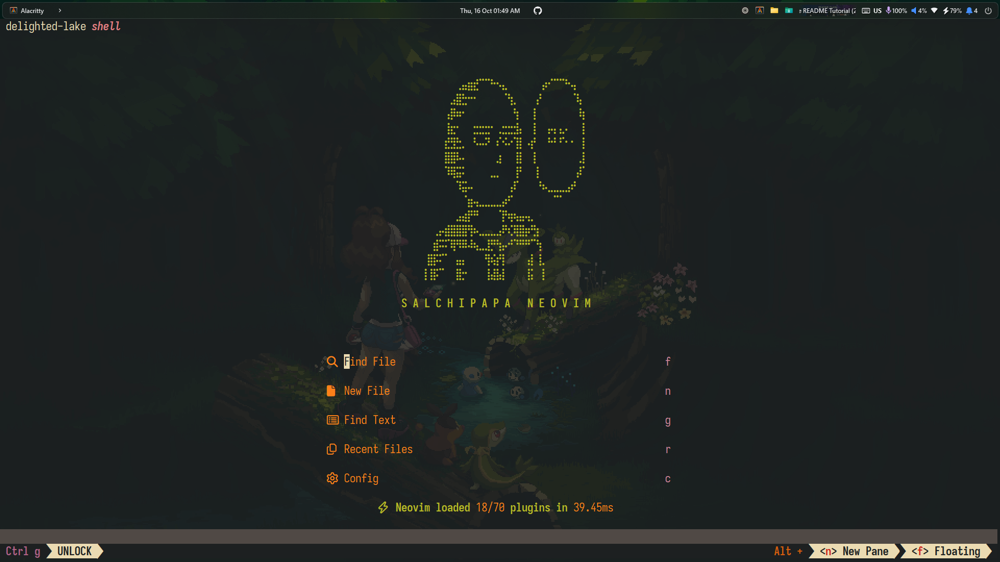
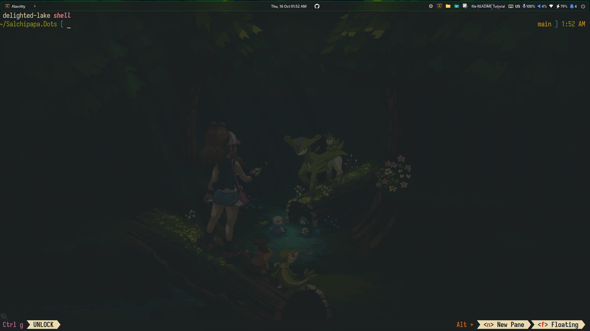

# 🧠 Salchipapa.Dots

<p align="center">
  
  
  <br>
  
</p>

---

## 🧩 Description

**Salchipapa.Dots** is a fully automated development environment setup designed for Linux systems.  
It configures **Zsh**, **Neovim**, **Zellij**, and multiple CLI utilities to create a fast, minimal, and powerful terminal experience.

Includes:

- **Neovim** with LSP, Treesitter, and Lazy plugin manager
- **Zsh** with Oh My Zsh, syntax highlighting, and autosuggestions
- **Zellij** with predefined layouts
- **Node.js + NVM**
- **AI integration** via Gemini CLI and custom plugins

You can choose between the **automatic installer** or **manual setup** depending on your preference.

---

## ⚙️ Automatic Installation (Recommended)

The easiest way to install everything!  
Run the setup script and let Salchipapa.Dots handle all configuration for you.

```bash
git clone https://github.com/yourusername/Salchipapa.Dots.git
cd Salchipapa.Dots
chmod +x install.sh
./install.sh
```

The script provides an interactive menu with:

- **Install** → complete setup (brew, zsh, nvim, zellij, symlinks, Lazy sync)
- **Install CLIs + Lazy sync** → installs `gemini` and `ng` separately, then runs Lazy sync

> ⚠️ The script requires sudo privileges for package installation.

---

## 🧠 Manual Installation

Follow these steps if you prefer a manual setup or if the installer fails.

> Replace `salchipapatest` with your username.

### 1️⃣ Update your system

```bash
sudo apt update
sudo apt upgrade
sudo apt install build-essential curl git ca-certificates
```

### 2️⃣ Install Homebrew and set up your PATH

```bash
/bin/bash -c "$(curl -fsSL https://raw.githubusercontent.com/Homebrew/install/HEAD/install.sh)"
echo >> /home/salchipapatest/.bashrc
echo 'eval "$(/home/linuxbrew/.linuxbrew/bin/brew shellenv)"' >> /home/salchipapatest/.bashrc
eval "$(/home/linuxbrew/.linuxbrew/bin/brew shellenv)"
```

### 3️⃣ Install dependencies via Homebrew

```bash
brew install gcc nvim zsh zsh-autocomplete zsh-syntax-highlighting zsh-autosuggestions carapace fzf zoxide atuin zellij fd eza bat nvm
```

### 4️⃣ Install Node.js and CLI tools

```bash
nvm install node
npm install -g @google/gemini-cli
npm install -g @angular/cli
```

### 5️⃣ Set Zsh as your default shell

```bash
echo "/home/linuxbrew/.linuxbrew/bin/zsh" | sudo tee -a /etc/shells
chsh -s /home/linuxbrew/.linuxbrew/bin/zsh $USER
```

### 6️⃣ Link Zsh configuration files

```bash
rm -f ~/.zshrc
ln -s ~/Salchipapa.Dots/SalchipapaZsh/.zshrc ~/.zshrc
source ~/.zshrc
```

### 7️⃣ Install Oh My Zsh (skip overwriting)

```bash
sh -c "$(curl -fsSL https://raw.githubusercontent.com/ohmyzsh/ohmyzsh/master/tools/install.sh)"
```

> ❌ When prompted to overwrite `.zshrc`, choose “No”

```bash
source ~/.zshrc
```

### 8️⃣ Link Zellij and Neovim configurations

```bash
mkdir -p ~/.config
ln -s ~/Salchipapa.Dots/SalchipapaZellij/zellij/ ~/.config/zellij
ln -s ~/Salchipapa.Dots/SalchipapaNvim/nvim/ ~/.config/nvim
```

### 9️⃣ Sync Neovim plugins

```bash
nvim --headless "+Lazy! sync" +qa
```

---

## 🤖 AI Integrations (Optional)

Salchipapa.Dots includes AI-ready tools for Neovim and Node.js environments:

- **Gemini CLI** → official Google AI command-line interface
- **nvim-gemini plugin** → integrates Gemini into Neovim
- **Node.js + NVM** → required runtime environment

To verify Gemini installation:

```bash
which gemini
```

If it returns a valid path, you’re ready to go.

---

## ✅ Quick Check

```bash
which zsh
which nvim
which gemini
which ng
```

Inside Neovim:

```vim
:echo executable('gemini')
```

If it prints `1`, your setup is ready.

---

## 📦 Repository Structure

```
Salchipapa.Dots/
├── install.sh                   → Automatic installer with interactive menu
├── SalchipapaZsh/               → Zsh configuration (plugins, themes, aliases)
├── SalchipapaNvim/              → Neovim setup (Lazy, plugins)
├── SalchipapaZellij/            → Zellij layouts and configuration
├── SalchipapaFastfetch/         → Fastfetch settings
└── other modules / utils
```

---

## 🧉 Credits & License

```
⠀⠀⠀⠀⠀⠀⠀⠀⣠⣴⣶⡋⠉⠙⠒⢤⡀⠀⠀⠀⠀⠀⢠⠖⠉⠉⠙⠢⡄⠀
⠀⠀⠀⠀⠀⠀⢀⣼⣟⡒⠒⠀⠀⠀⠀⠀⠙⣆⠀⠀⠀⢠⠃⠀⠀⠀⠀⠀⠹⡄
⠀⠀⠀⠀⠀⠀⣼⠷⠖⠀⠀⠀⠀⠀⠀⠀⠀⠘⡆⠀⠀⡇⠀⠀⠀⠀⠀⠀⠀⢷
⠀⠀⠀⠀⠀⠀⣷⡒⠀⠀⢐⣒⣒⡒⠀⣐⣒⣒⣧⠀⠀⡇⠀⢠⢤⢠⡠⠀⠀⢸
⠀⠀⠀⠀⠀⢰⣛⣟⣂⠀⠘⠤⠬⠃⠰⠑⠥⠊⣿⠀⢴⠃⠀⠘⠚⠘⠑⠐⠀⢸
⠀⠀⠀⠀⠀⢸⣿⡿⠤⠀⠀⠀⠀⠀⢀⡆⠀⠀⣿⠀⠀⡇⠀⠀⠀⠀⠀⠀⠀⣸
⠀⠀⠀⠀⠀⠈⠿⣯⡭⠀⠀⠀⠀⢀⣀⠀⠀⠀⡟⠀⠀⢸⠀⠀⠀⠀⠀⠀⢠⠏
⠀⠀⠀⠀⠀⠀⠀⠈⢯⡥⠄⠀⠀⠀⠀⠀⠀⡼⠁⠀⠀⠀⠳⢄⣀⣀⣀⡴⠃⠀
⠀⠀⠀⠀⠀⠀⠀⠀⠀⢱⡦⣄⣀⣀⣀⣠⠞⠁⠀⠀⠀⠀⠀⠀⠈⠉⠀⠀⠀⠀
⠀⠀⠀⠀⠀⠀⠀⢀⣤⣾⠛⠃⠀⠀⠀⢹⠳⡶⣤⡤⣄⠀⠀⠀⠀⠀⠀⠀⠀⠀
⠀⠀⠀⠀⣠⢴⣿⣿⣿⡟⡷⢄⣀⣀⣀⡼⠳⡹⣿⣷⠞⣳⠀⠀⠀⠀⠀⠀⠀⠀
⠀⠀⠀⢰⡯⠭⠹⡟⠿⠧⠷⣄⣀⣟⠛⣦⠔⠋⠛⠛⠋⠙⡆⠀⠀⠀⠀⠀⠀⠀
⠀⠀⢸⣿⠭⠉⠀⢠⣤⠀⠀⠀⠘⡷⣵⢻⠀⠀⠀⠀⣼⠀⣇⠀⠀⠀⠀⠀⠀⠀
⠀⠀⡇⣿⠍⠁⠀⢸⣗⠂⠀⠀⠀⣧⣿⣼⠀⠀⠀⠀⣯⠀⢸⠀⠀⠀⠀⠀⠀⠀

S A L C H I P A P A   N E O V I M
```

Created with ❤️ by **Salchipapa**  
Inspired by modern Linux-based developer environments.

**License:** MIT
